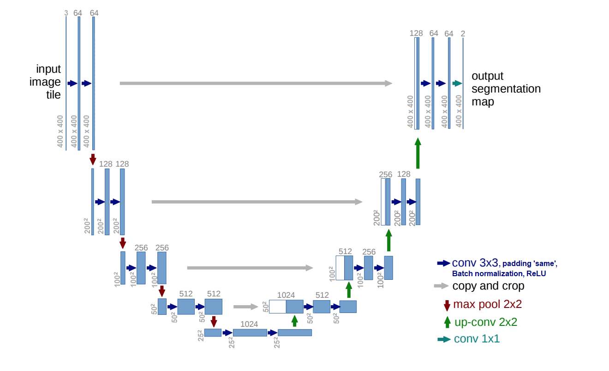
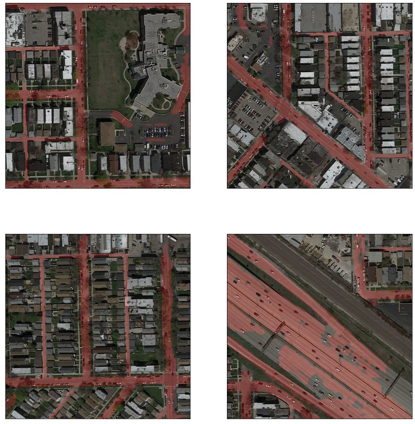

# Machine Learning CS-433 - Class Project 2 - Road Segmentation - EPFL
We built and trained a Convolutional Neural Network in Pytorch to perform semantic segmentation of roads on satellite images.   
We implemented a U-Net with padding inspired by [Ronneberger et al. (2015)](https://arxiv.org/pdf/1505.04597.pdf).   
We did Data augmentation by rotating (45, 90, 135, 180, 225, 270, 315) or flip image.

Our submission files are saved in the folder [submissions](submissions/).

The train and evaluation contains [100 train images of size 400x400](training) and [50 evaluation images of size 608x608](test_set_images).

You can consult our [report](report/BRAZ_DURAND_NICOLLE_Project2_Road_Segmentation_ML_EPFL.pdf) for more details.

### Contributors
- Lucas Braz [@Nagsky](https://github.com/Nagsky)
- Clément Nicolle [@Clement-Nicolle](https://github.com/Clement-Nicolle)
- Pierre-Alain Durand [@pierre-alain9](https://github.com/pierre-alain9)

Our U-Net graph:



See some of our results:



### Setup Environment
We run on Windows 10 with Conda 4.11 (Python 3.8) installed and Pytorch 1.10. It should work with any 3.6+ Python version with pip.

```bash
pip3 install torch==1.10.1+cu113 torchvision==0.11.2+cu113 torchaudio===0.10.1+cu113 -f https://download.pytorch.org/whl/cu113/torch_stable.html
pip3 install numpy
pip3 install sklearn
pip3 install scipy
pip3 install skimage
pip3 install matplotlib
pip3 install tqdm
pip3 install glob
pip3 install Pillow
```

### Run

To generate our final AIcrowd submission execute:

   ```bash
./run.py
   ```