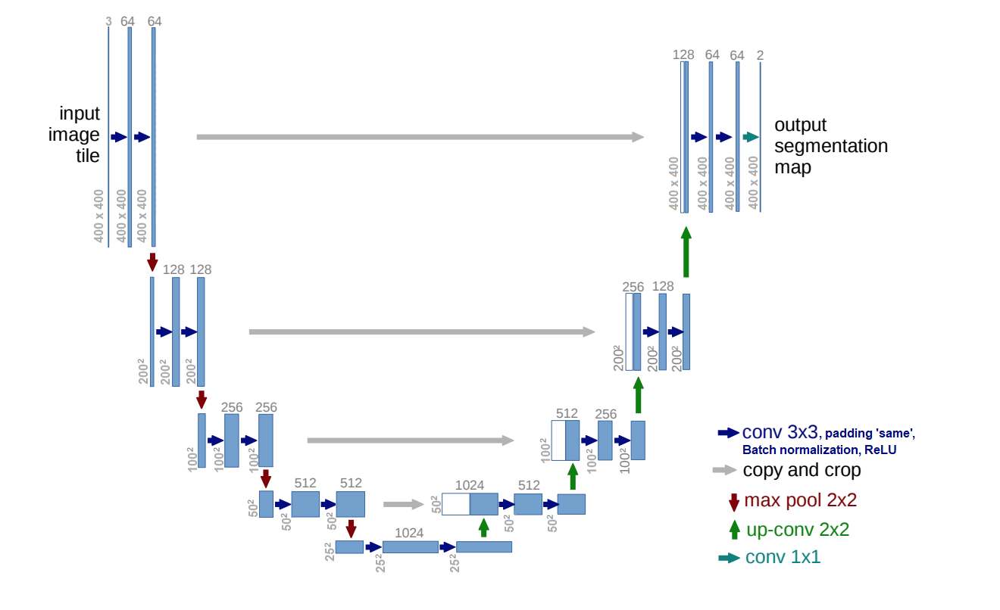
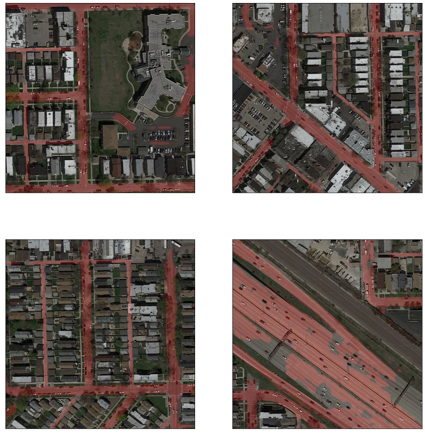

# Unet for Road Segmentation
We built and trained a Convolutional Neural Network in Tensorflow to segment roads on satellite images,
i.e. assign labels `road=1`, `background=0` to each pixel. We implemented a convolution/deconvolution U-Net with dilated layers from [Ronneberger et al. (2015)](https://arxiv.org/pdf/1505.04597.pdf). Data augmentation was a key element for performance improvement, we applied rotations, mirroring extension and vertical/horizontal flips.




The train and evaluation [data](https://github.com/aschneuw/ml-chiefs/tree/master/data) contains 100 and 50 images of size 400x400 and 604x604 respectively. These are some samples of our predictions on evaluation images:




Consult our [report](https://github.com/aschneuw/ml-chiefs/blob/master/report/report.pdf) for further information. 

*This project was part of the Machine Learning course taught at [EPFL](https://www.epfl.ch) by Prof. Urbanke and Prof. Jaggi.*

### Contributors

- Lucas Braz[@Nagsky](https://github.com/Nagsky)
- Clément Nicolle [@Clement-Nicolle](https://github.com/Clement-Nicolle)
- Pierre-Alain Durand [@pierre-alain9](https://github.com/pierre-alain9)

### Setup Environment
Our setup requires a Default Unix Environment (Ubuntu 16.04, or MAC OS X) with an installed Pyhton 3.5 or 3.6 Environment. Our implementation also requires the command `sha256sum` which is integrated OOB in Ubuntu. If you use OS X or Windows, install the command or do the model verification by computing the SHA256 with the appropriate tools. (Read more about model verification below)


### Run

To generate our final Kaggle submission execute:

   ```bash
./run.py
   ```

The predictions and the submission file are saved in the folder `prediction/`
